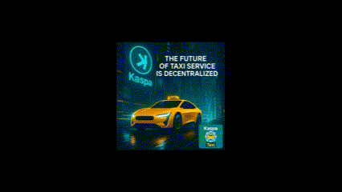

<div align="center">
  
  <h1>KaspaTaxi</h1>
  <p><strong>Decentralized Ride-Booking leveraging Kaspa</strong></p>
  <p>
    <a href="https://kaspataxi.KASperience.xyz">Official Demo</a> •
    <a href="#key-features-mvp---currently-functional">Features</a> •
    <a href="#getting-started">Getting Started</a> •
    <a href="#contribution-guidelines">Contribute</a> •
    <a href="#license">License</a> •
    <a href="#donations">Donate</a>
  </p>
</div>

---

**Welcome to KaspaTaxi!**

KaspaTaxi is an open-source project demonstrating a decentralized, transparent, and community-driven approach to ride-booking. Our vision is to empower independent taxi drivers and provide riders with a secure and direct way to connect and transact using the speed and efficiency of the Kaspa blockchain, ultimately aiming to reduce costs by eliminating intermediaries.

## Deployment Options

KaspaTaxi offers two deployment approaches to suit different needs:

### Option 1: Client-Only Deployment (Simple)

- **Branch**: `main`
- **Description**: Simpler setup with all functionality in the client
- **Best for**: Quick demos, learning, and development
- **Security note**: API keys are stored in client-side code (not recommended for production)

### Option 2: Secure Server Deployment (Recommended for Production)

- **Branch**: `server`
- **Description**: Secure architecture with server-side API handling
- **Best for**: Production deployments and public-facing applications
- **Security benefits**: API keys are protected on the server side

### Choosing the Right Approach

- **For learning and development**: The client-only approach (main branch) is simpler to set up and understand
- **For production use**: The secure server approach (server branch) follows best practices for security
- **For contributing**: Please follow the secure approach for any production-ready contributions

## 🚕 Try the Demo (MVP)

Experience the current KaspaTaxi MVP in action: [kaspataxi.KASperience.xyz](https://kaspataxi.KASperience.xyz)

*Note: The MVP focuses on demonstrating the core user interface, ride flow, and direct Kaspa payment initiation. Deeper blockchain integration and backend automation are planned for future phases.*

## Why Kaspa? (Our Vision)

*   **Decentralization & Transparency:** We aim to build a system where control rests more with drivers and riders, not a central platform. Kaspa's blockDAG structure offers transparency, and our open-source code allows community auditing.
*   **Direct & Efficient Payments:** By facilitating direct Kaspa payments between rider and driver, we aim to eliminate platform commissions. Kaspa's potential for fast transaction confirmations and low fees makes it ideal for near real-time settlement.
*   **Community-Driven Development:** We believe the platform should be built by and for its users. Open-source development encourages contribution and customization.
*   **Driver Empowerment:** Provide drivers with tools to manage their service independently, connect directly with riders, and potentially build their reputation on-chain in the future.

<div align="center">
  
</div>

## Key Features (MVP - Currently Functional)

*   **User Authentication:** Secure login using Google Authentication (centralized for ease of onboarding in the MVP). In the future, we plan to investigate decentralized identity solutions for user authentication.
*   **Map Integration:** Uses OpenStreetMap for visualizing locations and potential routes.
*   **Ride Request:** Riders can specify pickup and drop-off points to simulate a ride request.
*   **Driver View:** Drivers can see simulated nearby ride requests and accept/reject them.
*   **Basic Real-Time Updates:** Riders and drivers see basic status changes for the simulated ride flow (using Firebase Realtime Database or Firestore).
*   **Direct Kaspa Payment Initiation:** Upon ride completion (simulated), the app generates a QR code with the driver's Kaspa address and the fare, enabling direct peer-to-peer payment outside the app. **(Note: Transaction confirmation is not yet integrated within the app).**
*   **Mobile-First Design:** Responsive layout for use on various devices.
*   **Customizable Brand:** Easily modify the logo and theme for individual driver branding.
*   **Firebase Backend (MVP):** Utilizes Firebase for authentication, real-time data synchronization (ride status), and hosting.

## Planned Enhancements & Future Features

*   **Automated Ride Matching:** Implement backend logic (likely via Firebase Cloud Functions) for efficient driver assignment.
*   **On-Chain Transaction Verification:** Integrate Kaspa node interaction (via backend) to confirm payments directly within the app.
*   **Driver Registration & Verification:** Develop a secure process for driver onboarding, potentially involving smart contracts in later phases.
*   **Reputation System:** Explore building an on-chain or decentralized reputation system for drivers and riders.
*   **In-App Communication:** Add chat functionality between rider and driver.
*   **Fare Calculation:** Implement more dynamic fare calculation based on distance, time, etc.

## Technology Stack

*   **Frontend:** React (with TypeScript), Tailwind CSS, Vite
*   **Mapping:** OpenStreetMap (likely via libraries like Leaflet or MapLibre GL JS)
*   **Backend (MVP):** Firebase (Authentication, Firestore/Realtime Database)
*   **Blockchain (Payment):** Kaspa (Direct peer-to-peer via QR code)
*   **Future Backend:** Firebase Cloud Functions, Kaspa Node Interaction

## How Kaspa is Used (MVP vs. Future)

1.  **MVP:** Kaspa is used for the **payment settlement layer**. The app facilitates the *initiation* of a direct peer-to-peer Kaspa payment by generating a QR code containing the driver's address and agreed fare. The actual transaction occurs outside the app using the users' wallets.
2.  **Future:** We plan to integrate Kaspa more deeply for:
    *   **Payment Verification:** Confirming transaction success on the blockchain via backend services.
    *   **Data Integrity:** Potentially storing ride hashes or reputation data on-chain.
    *   **Smart Contracts:** Exploring contracts for driver registration or dispute resolution.

## Getting Started

### Prerequisites

- Node.js (v18 or higher)
- NPM or Yarn
- Firebase Account (for development/deployment)
- Kaspa Wallet (for testing payments)
- Firebase Studio or IDE

### Option 1: Client-Only Approach (main branch)

1. **Clone the Repository:**
   ```bash
   git clone https://github.com/YOUR-USERNAME/KaspaTaxi.git
   cd KaspaTaxi
   # Clone from main branch (default)
   ```

2. **Install Dependencies:**
   ```bash
   npm install
   ```

3. **Firebase Setup:**
   - Create a Firebase project
   - Enable Firestore and Authentication (Google provider)
   - Set up Firestore security rules (see Security Considerations section)

4. **Environment Configuration:**
   - Create a `.env` file in the project root with the following variables:
   ```
   VITE_FIREBASE_API_KEY=your_firebase_api_key
   VITE_FIREBASE_AUTH_DOMAIN=your_firebase_auth_domain
   VITE_FIREBASE_PROJECT_ID=your_firebase_project_id
   VITE_FIREBASE_STORAGE_BUCKET=your_firebase_storage_bucket
   VITE_FIREBASE_MESSAGING_SENDER_ID=your_firebase_messaging_sender_id
   VITE_FIREBASE_APP_ID=your_firebase_app_id
   VITE_MAPTILER_API_KEY=your_maptiler_api_key
   ```

5. **Start the Development Server:**
   ```bash
   npm run dev
   ```

### Option 2: Secure Server Approach (server branch - Recommended for Production)

1. **Clone the Repository:**
   ```bash
   git clone https://github.com/YOUR-USERNAME/KaspaTaxi.git
   cd KaspaTaxi

   # Switch to the server branch
   git checkout server
   ```

2. **Install Client Dependencies:**
   ```bash
   npm install
   ```

3. **Set up Client Environment Variables:**
   - Create a `.env` file in the project root with the following variables:
   ```
   VITE_FIREBASE_API_KEY=your_firebase_api_key
   VITE_FIREBASE_AUTH_DOMAIN=your_firebase_auth_domain
   VITE_FIREBASE_PROJECT_ID=your_firebase_project_id
   VITE_FIREBASE_STORAGE_BUCKET=your_firebase_storage_bucket
   VITE_FIREBASE_MESSAGING_SENDER_ID=your_firebase_messaging_sender_id
   VITE_FIREBASE_APP_ID=your_firebase_app_id
   ```

4. **Set up Server:**
   ```bash
   # Navigate to the server directory
   cd server

   # Install server dependencies
   npm install

   # Create .env file with API keys
   # Example content:
   PORT=3001
   MAPTILER_API_KEY=your_maptiler_api_key

   # Return to the main directory
   cd ..
   ```

5. **Start Both Client and Server:**
   ```bash
   # Run both client and server
   npm run dev:all

   # Or run just the client (if you don't need the server features)
   npm run dev
   ```

### Firebase Security Rules Deployment

After configuring your rules in the `firestore.rules` file:

```bash
# Install Firebase CLI if you haven't already
npm install -g firebase-tools

# Login to Firebase
firebase login

# Initialize Firestore for your project (if needed)
firebase init firestore

# Deploy the rules
firebase deploy --only firestore:rules
```

### IDX Configuration (If applicable)

- Ensure necessary environment variables are configured in `.idx/dev.nix`
- Rebuild the environment if needed within IDX

## Customization

*   **Branding:** Replace the logo in `src/assets/taxi-icon.png`, modify colors in `tailwind.config.js`.
*   **Features:** Add/modify components in `src/components`. Adjust Firestore data structures as needed.

## Contribution Guidelines

*   Contributions welcome! Please read [CONTRIBUTING.md](CONTRIBUTING.md).
*   Open issues for bugs or feature requests.
*   Driver feedback is highly valuable!

## Roadmap Outline

*   **Phase 1 (Current MVP):** Core UI/UX, Firebase auth/data sync, manual Kaspa QR payment generation.
*   **Phase 2 (Near-term):** Backend logic via Cloud Functions (ride matching, basic state management), integrate on-chain Kaspa payment verification.
*   **Phase 3 (Long-term):** Explore on-chain driver registration, reputation systems, further decentralization.

## Security Considerations

*   **API Key Security:** We use a secure server-side approach to handle API keys. See [API_KEY_SECURITY.md](API_KEY_SECURITY.md) for details.
*   **Secure API Architecture:** Our architecture follows security best practices for protecting sensitive operations. See [SECURE_API_APPROACH.md](SECURE_API_APPROACH.md) for details.
*   **Map Access:** The map is only accessible to authenticated users. Both WebApp and DriverApp components require user login to display the map and related functionality.
*   **Environment Variables:** Use `.env` for local development. For production, move sensitive keys (like Firebase Admin SDK keys) to secure server-side environments (e.g., Cloud Functions environment variables), *not* client-side code. API keys like MapTiler are now handled by the Express server in the `server` directory, which provides a secure proxy for these services.
*   **Firebase Security Rules:** Implement robust Firestore rules to control data access based on authentication and user roles. **(Remember to deploy your rules using the Firebase CLI as described in the 'Getting Started' section).** See details below.
*   **Authentication:** We use Firebase Authentication with secure token verification on the server side.
*   **Kaspa Transaction Verification (Future):** Implement server-side verification to prevent spoofed payment confirmations.

### Firestore Security Rules Details

The `kaspaTaxi/firestore.rules` file provides a baseline set of security rules critical for protecting your Firestore data. It starts by denying all access and then explicitly allows operations based on user authentication and roles.

**Key Assumptions Made in the Provided Rules:**

*   **`users` Collection:** Stores user profiles keyed by Firebase Auth UID. Contains fields like `isDriver` (boolean) and potentially `kaspaAddress`.
*   **`rides` Collection:** Stores ride details, including `riderId` (UID of the requesting user) and `driverId` (UID of the accepting driver, initially null).
*   **Authentication:** Rules heavily rely on `request.auth` to check if a user is logged in (`request.auth != null`) and who they are (`request.auth.uid`).

**Summary of Provided Rules (`users` collection):**

*   **Read:** Users can read their own profile. Authenticated users can read profiles marked as `isDriver = true` (consider restricting which fields are publicly readable).
*   **Create:** Users can create their own profile document.
*   **Update:** Users can update their own profile. (Validation to prevent unauthorized changes like self-assigning `isDriver` status is recommended).
*   **Delete:** Disallowed from the client.

**Summary of Provided Rules (`rides` collection):**

*   **Read:** The rider or assigned driver can read a ride document. Any authenticated user can read rides with `status = 'pending'` (allowing drivers to see requests).
*   **Create:** Authenticated users can create rides for themselves (`riderId` must match their UID), setting initial status to `pending` and ensuring basic fields exist.
*   **Update:** Allows specific state transitions based on user roles (driver accepting, rider/driver cancelling, driver updating status). Further validation (e.g., checking `isDriver` status via `get()`) might be necessary.
*   **Delete:** Disallowed from the client.

**IMPORTANT:**

*   **Review & Customize:** These rules are a starting point. **You MUST review and adapt them** to match your exact Firestore data structure, field names (`riderId`, `driverId`, etc.), and application logic (status values, allowed transitions).
*   **Test Thoroughly:** Use the Firebase Emulator Suite or a test project to verify these rules prevent unauthorized access and allow legitimate operations.
*   **Other Collections:** Add rules for any other collections you use (e.g., `driverLocations`).
*   **Deployment:** Deploy the final rules using `firebase deploy --only firestore:rules` as described in the Getting Started section.

## Disclaimer

KaspaTaxi is an experimental, open-source project. Use at your own risk. The authors are not liable for any issues or financial losses. Always verify Kaspa transactions independently.

## License

KaspaTaxi is available under a [dual licensing model](LICENSE.md):

1. **MIT License** - For use with the Kaspa blockchain and KAS native coin only
2. **Commercial License** - Required for use with other blockchains or KRC-20 tokens

Please refer to the [LICENSE.md](LICENSE.md) file for complete details.

## Contact

KASperience - dev@KASperience.xyz

## Donations

Support KaspaTaxi's development!

**Scan the QR Code or Copy the Address:**

<div align="center">
  
</div>

```
kaspa:qr02ac46a6zwqzxgp97lcjw3th4f70x9mq24jsk6vgfmvvhy39lpyksqj24y5
```

Thank you for your support!
